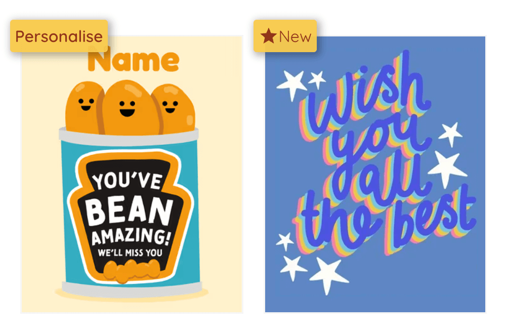

# Design Gallery Coding Challenge

## Run the project

The project should be self contained running a virtual mongodb instance in memory so the only requirement should be installing node/yarn.

```bash
yarn install

yarn start
```

The frontend should be available at `http://localhost:3002` and the backend at `http://localhost:5001`.

### DB Issues

The db runs in memory but is persisted to the `backend/test-db` folder so that it's easier to test changes. If you want to reset the db or there is an issue just delete the folder or run `yarn clean-db`.

## Challenge Overview

Implement new features for a design gallery application to enhance user interaction and content relevance.

## Tasks

### 1. Design Labels

- Add labels to designs (e.g., "new", "customisable")
- Customisable should be prioritised over new.
- New designs are ones created in the last 14 days.
- Design reference at bottom of README.

### 2. Heart/Like System

- Allow users to heart/like designs
- A user should be able to see which designs they have hearted and be able to remove the heart
- Must scale for many users
- This should just be on the main design page, you don't need to build a separate page for this feature
- Come up with your own design for this feature (it doesn't have to be perfect)

### 3. Trending Sort

- Implement sorting by trending designs
  - Trending calculation based on when it was created, how many times it has been used recently (and maybe how many hearts it has).
  - Consider how it would function with lots of designs and cards.

## Notes

- There is a fake user switcher setup in the navbar to simulate different users. You can access the current user on the api with `req.user`. Assume that this user has been properly authenticated and the id is valid for the purposes of this challenge. There is no need to implement real authentication.
- Feel free to add any additional libraries you think are necessary but please stick to using the core libraries provided (MUI, Next.js, Express, MongoDB).
- If possible try and show your progress through commits, ideally at least one commit per task.
- Try to stick to the existing code style.
- If you run out of time you don't need to implement everything, but have a think about what you would change if you had more time.

## Designs

Label design suggestion:

